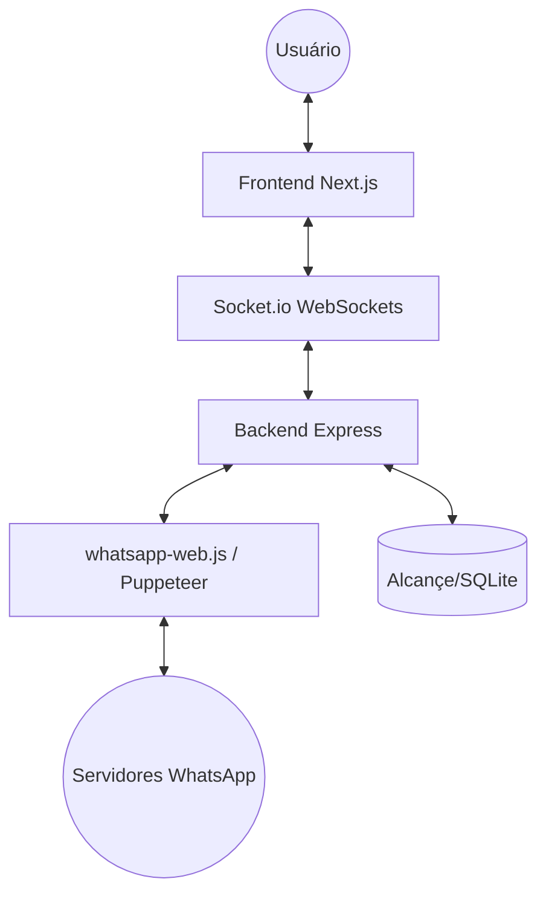

# WhatsApp Dispatcher Premium - Fullstack Architecture Document

## 1. Introduction
Este documento define a arquitetura técnica unificada para o projeto WhatsApp Dispatcher, garantindo que o backend integrado com WhatsApp e o frontend premium funcionem em harmonia seguindo os padrões AIOX.

### Change Log
| Date | Version | Description | Author |
| :--- | :--- | :--- | :--- |
| 2026-03-10 | 0.1.0 | Initial architecture design | @architect (Antigravity) |

## 2. High Level Architecture

### Technical Summary
A aplicação segue uma arquitetura baseada em eventos para a integração com o WhatsApp. O backend gerencia o ciclo de vida do cliente `whatsapp-web.js` (rodando em um processo Puppeteer) e comunica mudanças de estado (QR Code, Ready, Message) via WebSockets (Socket.io) para o frontend Next.js.

### Architecture Diagram

## 3. Tech Stack

| Category | Technology | Version | Purpose |
| :--- | :--- | :--- | :--- |
| Frontend | Next.js | 15.x | Framework de UI e roteamento |
| Backend | Node.js / Express | 20.x | Servidor de API e Engine WA |
| WA Engine | whatsapp-web.js | Latest | Integração com WhatsApp |
| Real-time | Socket.io | 4.x | Comunicação bidirecional FE/BE |
| Styling | Vanilla CSS | - | Design premium customizado |
| Icons | Lucide React | Latest | Sistema de ícones |
| Auth | LocalAuth | - | Persistência de sessão WA local |

## 4. Internal Workflows

### Campaign Engine Flow
1. **Upload**: User uploads CSV/Excel.
2. **Parsing**: Backend reads file and extracts numbers/variables.
3. **Queue**: Contacts are placed in an internal memory queue.
4. **Delay Engine**: 
    - Random interval (min_delay to max_delay) between each message.
    - Batch Pause: After N messages, wait X minutes.
5. **Execution**: Engine triggers `sendMessage`.
6. **Reporting**: Each result is logged in a `results` array and emitted via socket.

### Infrastructure Strategy
- **State Management**: Using an in-memory Campaign object for current session (to be evolved to LowDB/SQLite for persistence).
- **Socket.io**: Critical for progress bars and live status (Sent/Failed).

### Messaging Pipeline
1. Frontend envia POST `/send-message` com `number` e `message`.
2. Backend valida o formato do número.
3. Backend chama `client.sendMessage()`.
4. Backend retorna sucesso/erro para o FE.

## 5. Security & Anti-Ban
- **Random Delay:** Toda operação de envio em massa deve passar por um middleware de atraso aleatório (5-15 segundos).
- **Session Persistence:** Uso de `LocalAuth` para evitar múltiplos escaneamentos e reduzir o risco de bloqueio por "login suspeito".

---
— Orion, orquestrando o sistema 🎯
